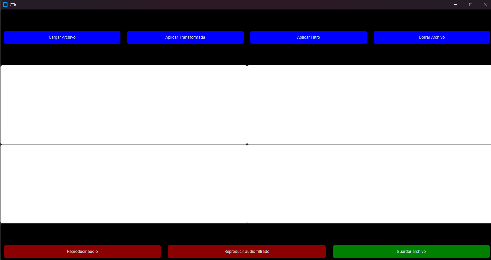
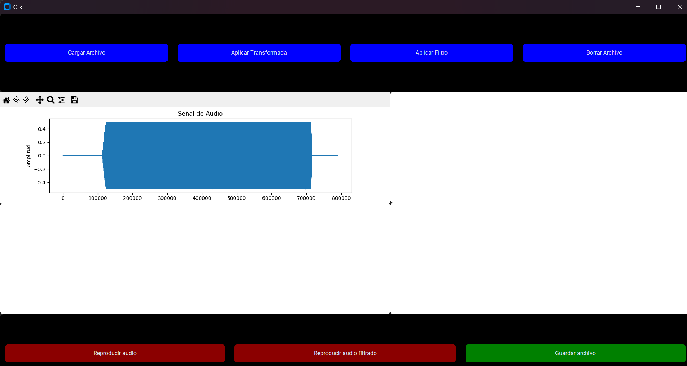

# Interfaz gráfica para el procesamiento digital de señales

Implementación de una interfaz simple para el procesamiento digital de audio. Se permite la carga de archivos, cálculo de transformada de Fourier y la implementación de diversos filtros para observar el comportamiento de la señal cargada. Ideal para probar con canciones o audios cuya finalidad sea obtener ciertos componentes frecuenciales.

### Instalación
Se recomienda generar un ambiente virtual con _virtualenv_ para así seleccionar una versión específica de python. En el caso de esta interfaz se recomienda la versión 3.12.0.

 Inicialmente se deben de instalar las dependencias necesarias, en este caso se encuentra en el archivo de texto _requirements.txt_ y se recomienda utilizar _pip_ para la instalación de la siguiente manera:

```bash
pip install requirements.txt
```

**Importante:** La librería utilizada para la lectura de audio: _Librosa_, necesita de la herramienta de decodificación de audio **ffmpeg**. Esta herramienta vendrá por defecto para usuarios de Linux u OSX, sin embargo, para usuarios de Windows, se requiere hacer la instalación externa. Para más información:

* [FFmpeg](https://www.ffmpeg.org/)
* [Librosa](https://librosa.org/doc/main/install.html)

Una vez instaladas las dependencias, es posible correr el archivo _audio_gui.py_. Este código contiene la lógica y generación de interfaz completa.

### Utilización
Ejecutar la interfaz es tan simple como correr el archivo:

```bash
python audio_gui.py
```



De inicio se podrá ver una ventana con controles y un lienzo vacío. En este punto cualquier acción está restringida a excepción de "Cargar archivo". Se ejemplifica con el archivo _sweep.mp3_ el cual realiza un barrido de frecuencias desde los 0Hz a 20kHz.

La carga de archivo habilita la gráfica de audio contra tiempo y es manipulable gracias a la navegación de _matplotlib_. Es importante mencionar que los archivos grandes podrán ralentizar el proceso de cargado de audio. Cada vez que se aplique la carga de audio, se reemplazará en el lienzo de graficación.



Posterior a la carga de audio, se pueden seguir varias acciones.

##### Aplicación de transformada
Aplicar la transformada genera una gráfica con la transformada de Fourier para observar los componentes frecuenciales del audio cargado, de igual manera es manipulable gracias a _matplotlib_.

##### Aplicación de filtros
Se pueden aplicar 3 filtros: Pasa bajas, pasa altas y pasa banda. El botón de "Aplicar filtro" abre el menú de selección de filtro, frecuencia de corte (baja y alta en caso de pasa banda) y orden del filtro.

##### Reproducir audio
La reproducción de audio está permitida una vez que se cargue un archivo, además, la reproducción de audio filtrado se habilita una vez que se haya procesado el audio. **Importante**: La reproducción por defecto convierte los audios a fromato WAV, es probable que el sistema no soporte este formato, por lo que la reproducción podrá tener problemas.

##### Guardar audio
El audio se puede guardar en 4 formatos:

* WAV
* FLAC
* OGG
* MP3

Una vez que se haya generado ya un audio procesado.


##### Borrar audio
Este botón reinicia la interfaz y deja el lienzo vacío así como ningún procesamiento realizado.
