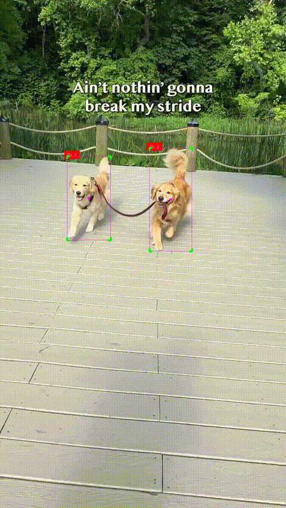
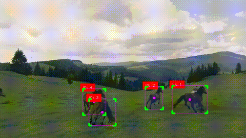
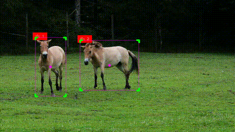
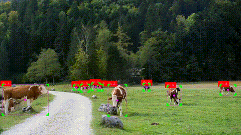
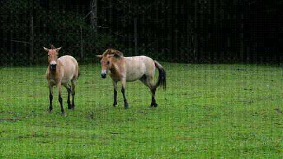

# Sistema de detección y seguimiento de animales

Sistema capaz de detectar y realizar el seguimiento de animales en tiempo real con utilización de algoritmos de aprendizaje profundo como YOLO y de seguimiento de objetos como lo es SORT y DeepSORT. Estos algoritmos de seguimiento utilizan filtros de Kalman para estimar la trayectoria de los objetos en movimiento, incluso cuando las detecciones son ruidosas o intermitentes. 

Para el desarrollo de este sistema se implementó utilizando Python 3.12.0, _SORT_ de código abierto, _deep-sort-realtime_ y el modelo yolov8l de _ultralytics_. Además de ciertas librerías como _OpenCV_, _Numpy_ _CVzone_ y _filterpy_. Para el manual general de ejecución, se puede observar el proyecto de [HMI_DSP](../HMI_DSP) (Interfaz de procesamiento digital de señales); sin embargo, en este apartado se explicará el desempeño del sistema y los fundamentos técnicos.


### YOLO
YOLOv8 es un detector de objetos basado en redes neuronales convolucionales que realiza inferencias en una sola pasada sobre la imagen, combinando rapidez y precisión. En este sistema, se utiliza el modelo preentrenado _yolov8l.pt_ de Ultralytics, con soporte para detección de múltiples clases. Solo se consideran detecciones con confianza mayor a 0.5 y pertenecientes a clases de interés, como horse.

Características principales:

* Inferencia rápida en GPU y CPU.

* Alta precisión en la detección de bordes.

* Capacidad de trabajar en flujos de video.

Se utilizó YOLOv8 como modelo de detección porque ofrece una excelente relación entre velocidad y precisión, lo cual es fundamental para aplicaciones en tiempo real como el seguimiento de animales en video. YOLO permite realizar inferencias muy rápidas sin sacrificar exactitud o con confusión, incluso cuando se corre en una GPU con baja memoria y núcleos o directamente en CPU.

### Filtro de Kalman
El filtro de Kalman es un estimador recursivo que permite predecir el estado de un sistema dinámico en presencia de ruido. En este caso, se utiliza para estimar y actualizar la posición de los objetos detectados, proporcionando robustez frente a detecciones ruidosas o ausentes.

El modelo de estados es de 7 dimensiones:

**x** = [ _u_, _v_, _s_, _r_, ẋ, ẏ, ṡ ]

Donde:

- \( u, v \): Coordenadas del centro de la caja que encierra al objeto (bounding box). En lugar de usar directamente los bordes, se usa el centro porque es más estable para predecir el movimiento.

- \( s \): Área. Sirve para saber si el objeto se acerca o se aleja de la cámara. Mientras mayor es, más cerca se encuentra
- \( r \): Razón de aspecto. Se usa para mantener la forma del objeto al predecir nuevos cuadros. Es decir, en este caso, la posición de un animal.
- \( u punto, v punto \): Velocidad en x y y. Predicción de ubicación en determinado tiempo.
- \(s punto): Velocidad de cambio de área.

### SORT y DeepSORT
**SORT (Simple Online and Realtime Tracking)**
Asigna IDs a cada objeto detectado mediante la predicción del filtro de Kalman y una estrategia de asignación basada en IOU (Intersección sobre Unión).

Se usa cuando no se requiere información adicional, muy útil en el caso de animales, no se requiere información adicional de apariencia visual.

**DeepSORT**
Extiende SORT utilizando un extractor de características visuales para mejorar la asociación entre detecciones y trayectorias. Utiliza métricas de distancia del espacio latente (coseno) para reforzar el seguimiento, ideal para escenarios con múltiples objetos similares.

A lo largo de este desarrollo, se explicarán las diferencias fundamentales entre ambos y se comparará su desempeño sobre todo.

### Funcionamiento general y resultados
Primeramente, el abordaje fue utilizar un modelo preentrenado de YOLOv8 para la detección de animales y con el uso de SORT, proveer de una solución al seguimiento. Dentro de este algoritmo, los parámetros más importantes son: 

* **max_age=60**: Este parámetro define cuántos frames puede permanecer _activo_ un objeto rastreado sin recibir nuevas detecciones antes perderse, o no obtener nuevas actuzalizaciones y ser eliminado del seguimiento. Este valor es alto para permitir que los animales se sigan detectando aún cuando salgan de frame o se pierda el ángulo.

* **min_hits=1**: Establece el número mínimo de veces que un objeto debe ser detectado de manera consistente para ser considerado como un objet válido. Un valor pequeño permite que el seguimiento se adecue a cambios bruscos.

* **iou_threshold=0.1**: Define el umbral mínimo del coeficiente de Intersection over Union (IoU) para asociar detecciones consecutivas al mismo animal. Un valor bajo, como en ese caso, implica que se permite mayor variación en la posición del objeto entre cuadros, lo cual es útil cuando las detecciones de YOLO son ruidosas o hay movimientos bruscos.

Estos parámetros definen el trackeo inicial, y se utiliza de la siguiente manera:

(Código extraído de main.py)
```bash
detections = np.empty((0, 5)) #Arreglo para detecciones
results = self.predict(img) #Predicción de YOLOv8
detections, frames = self.plot_boxes(results, img, detections) #Marcar como detecciones para tracker
```

Este fragmento de código complementa al seguimiento ya que, inicialmente inicializa el arreglo para las detecciones con el formato: [x1, y1, x2, y2, confidence], después se genera la predicción con el modelo preentrenado para finalmente marcar ese resultado como una detección más para el seguimiento.

La línea:
```bash
resultTracker = tracker.update(detections)
```

Dentro de la función _track_detect_, recibe las detecciones dadas por YOLO y devuelve cajas con el formato [x1, y1, x2, y2, ID], donde ID es el identificador de cada animal en específico.

Esto finalmente se realiza iterativamente y progresivamente con cada frame permitiendo identificar y seguir cada detección ligada a un identificador. Los resultados son los siguientes:

**Seguimiento de perros:**


**Seguimiento de caballos:**



**Seguimiento de vacas:**


**Importante**: Para mejor calidad de visualización, los videos se encuentran en la carpeta _result_.

Es importante mencionar que en todos los casos, a excepción de las vacas, por el video, los identificadores se suelen perder a menudo. Esto sucede porque el algoritmo SORT solo utiliza la posición y el tamaño de las _bounding boxes_ para asociar objetos entre frames consecutivos. En escenas con oclusiones, cambios bruscos de trayectoria o detecciones inconsistentes, esta estrategia no es la mejor, sobre todo considerando los movimientos bruscos o impredecibles que los animales pueden realizar.

Es por eso que de igual forma de realizó la implementación con DeepSORT, lo que permite comparar la apariencia de los objetos y reducir los errores de reasignación de identificadores para cada animal, generando un sistema más robusto y seguimiento estable.

En esencia, la detección funciona de manera similar, así como la manera de guardar detecciones para el seguimiento, sin embargo, la instancia de deep sort cuenta con más parámetros muy importantes.

(Código extraído de main_deep.py)
```bash
self.tracker = DeepSort(
    max_age=60,
    n_init=5,
    nms_max_overlap=0.6,
    max_cosine_distance=0.3,
    nn_budget=100,
)
```

* **max_age=60**: Mismo de SORT.

* **n_init=5**: Requiere que un animal haya sido detectada durante al menos **5** frames consecutivos para considerarse válido, para evitar falsos positivos.

* **nms_max_overlap=0.6**: Define el umbral de superposición. Permite  redundancia en las detecciones cuando hay varios objetos cercanos. Importante.

* **max_cosine_distance=0.3**: Límite de similitud visual (medida por distancia coseno) para asociar detecciones con pistas existentes. Cuanto menor es este valor, más exigente es el algoritmo en que la apariencia del animal coincida. Este parámetro es complicado al trabajar con animales.

* **nn_budget=100**: Mejora el rendimiento evitando usar demasiada memoria al limitar embeddings por detección.

Los resultados son los siguientes:

**Seguimiento de caballos:**


Si bien es cierto que el sistema es robusto al seguimiento, la detección ante oclusiones puede dejar de ser ideal ya que DeepSORT depende fuertemente de las detecciones proporcionadas en cada cuadro. Cuando un objeto queda parcialmente o totalmente ocluido (por ejemplo, cuando un caballo pasa detrás de otro), el modelo YOLO puede dejar de detectarlo, y como consecuencia, el tracker pierde información clave.

#### Referencias
* Ultralytics YOLOv8: https://docs.ultralytics.com

* SORT: Bewley et al., "Simple Online and Realtime Tracking", 2016.

* DeepSORT: Wojke et al., "Simple Online and Realtime Tracking with a Deep Association Metric", 2017.

* filterpy: https://github.com/rlabbe/filterpy

* cvzone: https://github.com/cvzone/cvzone
